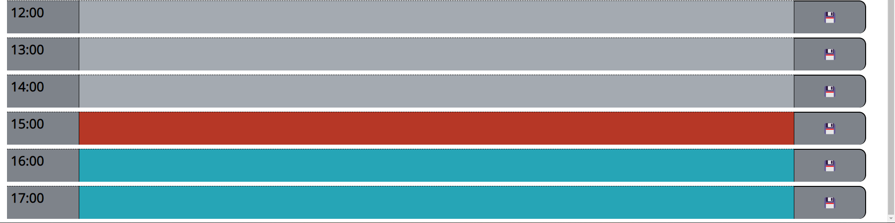

# Challenge 05 


## Daily Calendar

---

### Contents 

---

1. Objectives
2. About
3. Screenshots
4. Links
5. Assignment details & grading rubric (*ignore me*)

<br>
<br>

### Objectives ###

---

<br>

1. WHEN the user opens the planner the current day is displayed at the top of the calendar.
2. WHEN the user scroll down they are presented with timeblocks for standard business hours.
3. WHEN viewed, each timeblock is color coded to indicate whether it is in the past, present, or future.
4. WHEN a timeblock is clicked, the user can enter an event.
5. WHEN the save button for that timeblock is clicked, the text for that event is saved in local storage.
6. WHEN the page is refreshed the saved events persist.

<br>
<br>

### About ###

---

<br>

1. WHEN the user opens the planner the current day is displayed at the top of the calendar.
    > When the page is opened, the user is presented with a daily planner. Included in the title is the current date & time formatted for readability. This date/time is set to a timer so it is refreshed every second so that the exact current date/time is always displayed.

<br>

2. WHEN the user scroll down they are presented with timeblocks for standard business hours.
    > The current state of this page is standard business hours from 0900 - 1800. By storing these values in an array, the calendar can easily be expanded or adapted to a users specific time preferences by changing the array values.

<br>

3. WHEN viewed, each timeblock is color coded to indicate whether it is in the past, present, or future.
    > Each time block is color coded based upon the current time of day. the current hour is displayed as a red color, while past events grey out and text is struck through, finally future events are colored green. This is achieved by assigned dataset values to the cells and comparing those values to the current time using moment() and formatting to 'HH'. If the dataset value is equal to the current moment() value, it is assigned a class of either 'past', 'future' or 'present'. By assigning these classes it allows the CSS sheet to dynamically apply properties to the classes.
<br>

4. WHEN a timeblock is clicked, the user can enter an event.
    > Timeblocks are built as text areas so the user can easily click on a cell and type in whatever event they wish to input.

<br>

5. WHEN the save button for that timeblock is clicked, the text for that event is saved in local storage..
    > Save buttons are built within the rows and appended to the row. These buttons are also given dataset values that correspond with the hours timeblock. This is necessary to ensure the save buttons are specific to each timeblock and do not arbitrarily save values from other blocks. To the bottom of the script.js file is a click event handler that ensures proper saving of the values. This function uses the .each() method to iterate over the timeblock elements. Each iteration uses an if statement to compare the dataset value of the button clicked and then as the function iterates through the timeblocks, compares the datasets until a matching pair is found. Once a matching pair is found, the text in the timeblock is put into an empty object and then assigns the dataset value into another key of the object. The object is then pushed into an array for local storage and then the object is cleared and reset, ready for new data. Once the object is added to the array, local storage is set so that upon reload of the page, the data can persist.

<br>

6. WHEN the page is refreshed the saved events persist.
    > When the save button is pressed and the function completes, the array that the objects are pushed to are set to local storage. The init() function retrieves local storage and assigns any existing values into the empty array created upon loading the page. This same function calls the populateCalendar() function that iterates over the timeblocks and for each item in the DOM it iterates through the array. Then compares the dataset value of the array. If an object in the array has a matching value stored, the the text value for that object is pupulated into the timeblock. If no matches are found, nothing happens. This ensures that the data input into the field persists upon reloading the page.

<br>
<br>

### Screenshots ###

---

<br>


<br>

Header displaying current time.

<br>

  ---

<br>



<br>

Calendar body with different colors based upon time.

<br>

  ---

<br>


<br>

Example of user input being saved and persisting upon reload of page.

<br>


### Links ###

---

<br>


Link to Github repo: https://github.com/JDReeves86/05ChallengeTurnIn


Link to live page: https://jdreeves86.github.io/05ChallengeTurnIn/

<br>
<br>
<br>
<br>
<br>
<br>
<br>
<br>
<br>

---

---

## Assignment Details & Grading Rubric ##

---

---

<br>
<br>


# 05 Third-Party APIs: Work Day Scheduler

## Your Task

Create a simple calendar application that allows a user to save events for each hour of the day by modifying starter code. This app will run in the browser and feature dynamically updated HTML and CSS powered by jQuery.

You'll need to use the [Moment.js](https://momentjs.com/) library to work with date and time. Be sure to read the documentation carefully and concentrate on using Moment.js in the browser.

## User Story

```md
AS AN employee with a busy schedule
I WANT to add important events to a daily planner
SO THAT I can manage my time effectively
```

## Acceptance Criteria

```md
GIVEN I am using a daily planner to create a schedule
WHEN I open the planner
THEN the current day is displayed at the top of the calendar
WHEN I scroll down
THEN I am presented with timeblocks for standard business hours
WHEN I view the timeblocks for that day
THEN each timeblock is color coded to indicate whether it is in the past, present, or future
WHEN I click into a timeblock
THEN I can enter an event
WHEN I click the save button for that timeblock
THEN the text for that event is saved in local storage
WHEN I refresh the page
THEN the saved events persist
```

The following animation demonstrates the application functionality:


## Grading Requirements

> **Note**: If a Challenge assignment submission is marked as “0”, it is considered incomplete and will not count towards your graduation requirements. Examples of incomplete submissions include the following:
>
> * A repository that has no code
>
> * A repository that includes a unique name but nothing else
>
> * A repository that includes only a README file but nothing else
>
> * A repository that only includes starter code

This Challenge is graded based on the following criteria: 

### Technical Acceptance Criteria: 40%

* Satisfies all of the above acceptance criteria plus the following:

  * Uses a date utility library to work with date and time

### Deployment: 32%

* Application deployed at live URL

* Application loads with no errors

* Application GitHub URL submitted

* GitHub repo contains application code

### Application Quality: 15%

* Application user experience is intuitive and easy to navigate

* Application user interface style is clean and polished

* Application resembles the mock-up functionality provided in the Challenge instructions

### Repository Quality: 13%

* Repository has a unique name

* Repository follows best practices for file structure and naming conventions

* Repository follows best practices for class/id naming conventions, indentation, quality comments, etc.

* Repository contains multiple descriptive commit messages

* Repository contains quality README file with description, screenshot, and link to deployed application

## Review

You are required to submit the following for review:

* The URL of the deployed application

* The URL of the GitHub repository, with a unique name and a README describing the project

- - -
© 2022 Trilogy Education Services, LLC, a 2U, Inc. brand. Confidential and Proprietary. All Rights Reserved.
